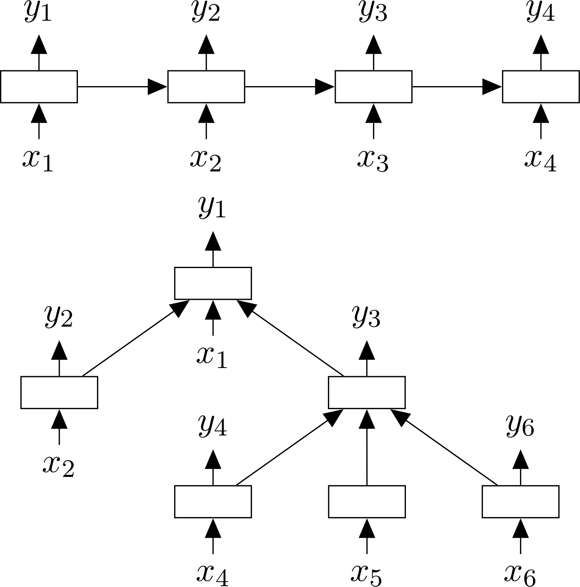

# Papers

### Improved Semantic Representations From Tree-Structured Long Short-Term Memory Networks

http://www.aclweb.org/anthology/P15-1150
https://arxiv.org/abs/1503.00075

Details:
* Input to RNN/LSTM: previous step hidden state & next element from sequence.
* Input to Child-Sum Tree-LSTM: sum of hidden states of children & element from current node.

Thoughts:
* Child-Sum Tree-LSTMs
  * normalize by dividing by number of children
  * RNN with attention
* Tree-RNN:
  * Everything that can be used in RNN/LSTM should be possible to use with tree-RNN
  * Attention, multilayer, bi-directional, etc
  * Example:
    * [Modelling Sentence Pairs with Tree-structured Attentive Encoder](https://arxiv.org/abs/1610.02806v1)
  * The only significant difference: make some function that will combine children together into one feature vector
* Sentiment classification improvement ~1% - quite shallow improvement

### When Are Tree Structures Necessary for Deep Learning of Representations?

https://nlp.stanford.edu/pubs/emnlp2015_2_jiwei.pdf

Details (summary from article):
* In cases where tree-based models do well, a simple approximation to tree-based models seems to improve recurrent models to equivalent or almost equivalent performance: (1) break long sentences (on punctuation) into a series of clause-like units, (2) work on these clauses separately, and (3) join them together. This model sometimes works as well as tree models for the sentiment task, suggesting that one of the reasons tree models help is by breaking down long sentences into more manageable units.
* Despite that the fact that components (outputs from different time steps) in recurrent models are not linguistically meaningful, they may do as well as linguistically meaningful phrases (represented by parse tree nodes) in embedding informative evidence, as demonstrated in UMD-QA task. Indeed, recent work in parallel with ours (Bowman et al., 2015) has shown that recurrent models like LSTMs can discover implicit recursive compositional structure.
* In tasks like semantic relation extraction, in which single headwords need to be associated across a long distance, recursive models shine. This suggests that for the many other kinds of tasks in which long-distance semantic dependencies play a role (e.g., translation between languages with significant reordering like Chinese-English translation), syntactic structures from recursive models may offer useful power.
* Tree models tend to help more on long sequences than shorter ones with sufficient supervision: tree models slightly help root level identification on the Stanford Sentiment Treebank, but do not help much at the phrase level. Adopting bi-directional versions of recurrent models seem to largely bridge this gap, producing equivalent or sometimes better results.
* On long sequences where supervision is not sufficient, e.g., in Pang at al.,’s dataset (supervision only exists on top of long sequences), no significant difference is observed between tree based and sequence based models.

Thoughts:
* Break long sequences into shorter ones -> work on them separately -> join results
* Tree based RNN should work better on long sequences because distance between nodes will be shorter (but in most of the datasets they used sequences were short).
* To be honest - there are not so much of improvements with tree based RNN. Probably because of: short sequences or other solutions are highly optimized and have been developed for long time.

### Long Short-Term Memory Over Tree Structures
https://arxiv.org/pdf/1503.04881.pdf

Details:

Thoughts:
* Approximately the same as Child-Sum Tree-LSTM
* Difference:
  * Only binary trees
  * Another function to combine children

### arxiv-sanity: similar to "Top-down Tree Long Short-Term Memory Networks"
http://arxiv-sanity.com/1503.00075

Details:

Thoughts:
### Recurrent Memory Networks for Language Modeling: in Sentence Completion Challenge, for which it is essential to capture sentence coherence, our RMN obtains 69.2% accuracy, surpassing the previous state-of-the-art by a large margin.
https://arxiv.org/abs/1601.01272v2

Details:

Thoughts:
### P-Tree Programming
https://arxiv.org/pdf/1707.03744v1.pdf

Details:

Thoughts:
Not related to NN
### Dependency Recurrent Neural Language Models for Sentence Completion
https://arxiv.org/abs/1507.01193v1

Details:

Thoughts:
Not related to tree-based RNN/LSTM
### Groups convolution
http://colah.github.io/posts/2014-12-Groups-Convolution/

Details:
* This essay takes an unusual perspective on group theory

Thoughts:
* No results, no code, just thoughts

